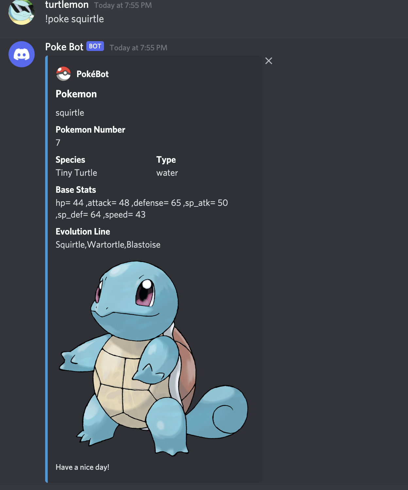

# Discord-Pokedex-Bot

This Python-based Discord bot is designed to mimic the functionality of the iconic "Pokédex" from the famous Pokémon franchise. Using Python APIs such as pokedex, pypokedex, and discord.py, this bot allows users to search for detailed information about various Pokémon species, including their abilities, types, evolutions, and more, all within the comfort of their Discord server.

## Features

The Pokédex Discord Bot offers several exciting features for Pokémon enthusiasts:

Pokémon Information: Users can retrieve comprehensive information about any Pokémon, including its name, types, stats and evolution.

Pokémon Art: The bot provides an image of the requested Pokémon to help users visualize their favorite creatures.

Evolution Details: Users can discover the evolution chain of a Pokémon, including the species it evolves from and into.

## Setup

To set up the Pokédex Discord Bot, follow these steps:

1. Create a Discord Bot: Visit the [Discord Developer Portal](https://discord.com/developers/applications/) to create a new bot and obtain its token.

2. Install Dependencies: Install the required Python libraries using pip

```bash
pip install pokedex pypokedex discord.py
```

3. Clone the repo

```bash
https://github.com/aayushsss1/Discord-Pokedex-Bot.git
```

4. Configuration: Create a configuration file or environment variables to store your bot's token securely

5. Bot Invite: Create an invite link for your bot to join your Discord server. You can do this via the Discord Developer Portal.

6. Run the Bot: Execute the Python script to run the bot -

```bash
python poke.py
```

7. Interact with the Bot: You can now interact with the bot on your Discord server and access Pokédex information by using the provided commands.


## Usage

Once the bot is set up and running on your Discord server, you can use the `!poke` command to interact with it and retrieve Pokémon information. 

- !poke <pokemon_name>: Retrieve information about a specific Pokémon.

<div align = "center">
<kbd>

</kbd>
</div>
